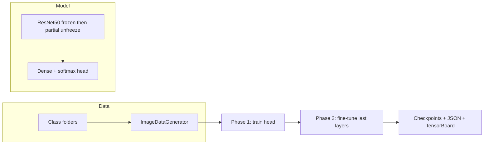

# Training summary

This document briefly describes **what** the training stack uses and **how** the model is trained end to end. Implementation lives mainly in `backend/src/train_model.py` and `backend/src/classifier.py`.

---

## What each piece is for

| Piece | Role |
|--------|------|
| **TensorFlow / Keras** | Deep learning framework used to build, compile, and fit the network. |
| **ResNet50 (ImageNet)** | Pre-trained convolutional backbone. Weights come from ImageNet; the original classifier layers are dropped (`include_top=False`). |
| **Frozen backbone (initially)** | ResNet50’s layers start **non-trainable** so early training only updates the new layers on top—standard **transfer learning**. |
| **Custom classification head** | Dense layers with ReLU, dropout, then a **softmax** over your classes (typically **2**: real vs fake). Built in `ProductClassifier._build_model()`. |
| **`resnet50.preprocess_input`** | ImageNet-style normalization applied inside the model graph so inputs match what ResNet50 expects. |
| **`ImageDataGenerator` + `flow_from_directory`** | Loads images from disk folders, resizes to **224×224**, batches them, and applies **augmentation** only on the training stream. |
| **Training augmentation** | Random rotation, shifts, horizontal flip, zoom, and brightness jitter—helps generalization; validation uses **no** augmentation. |
| **`sparse_categorical_crossentropy`** | Loss function when labels are integers (0, 1, …) rather than one-hot vectors. |
| **Adam optimizer** | Adaptive optimizer; learning rate is set per phase when compiling the model. |
| **Class weights** (optional) | `sklearn.utils.class_weight.compute_class_weight` can balance loss when one class has many more images than the other. |
| **Callbacks** | **EarlyStopping** (stop when validation accuracy stalls, restore best weights), **ModelCheckpoint** (save best `.h5` per phase), **ReduceLROnPlateau** (lower LR when metrics plateau), **TensorBoard** (logs under `models/logs/`). |

---

## How training works (step by step)

1. **Prepare the dataset**  
   Use a folder layout Keras expects: a **training** root and a **validation** root. Under each, **one subfolder per class** (e.g. `real/`, `fake/`). Put images in the matching folders.

2. **Create data generators**  
   Call `create_data_generators(train_dir, val_dir, ...)` in `train_model.py`. This returns a train generator (with augmentation) and a validation generator (no augmentation), both feeding **224×224** RGB batches with **sparse** integer labels.

3. **Build the classifier**  
   Instantiate `ProductClassifier` (ResNet50 + head). The base model starts **frozen**.

4. **Phase 1 — Transfer learning**  
   `ModelTrainer.train_phase1(...)` compiles the model with a **higher** learning rate (e.g. `1e-3` by default in the trainer) and trains **only the classification head** while ResNet50 stays frozen. Callbacks monitor **validation accuracy**, save checkpoints, and can stop early.

5. **Phase 2 — Fine-tuning**  
   `ModelTrainer.train_phase2(...)` **unfreezes** the last portion of ResNet (e.g. last **20** layers—configurable), recompiles with a **lower** learning rate (e.g. `1e-5`), and continues training so the backbone can adapt slightly to your domain without destroying pretrained features.

6. **Save artifacts**  
   Best weights are written under your output directory (default **`models/`**) as checkpoint HDF5 files per phase. `save_training_summary()` writes **`training_summary.json`** with timestamps and phase metrics. TensorBoard event files go under **`models/logs/`** for optional visualization.

7. **Use the trained model in the app**  
   Point the API / `ProductClassifier` loading path at the saved weights you want for inference (see project `README` and backend config).

---

## Quick mental model



---

## Running training from Python

There is no full CLI entry point in `train_model.py`’s `__main__` block; you run training from Python (e.g. a small script or REPL). From the **repo root**, you can add `backend/src` to `sys.path` as below; if your current directory is **`backend/`**, use `from src.classifier import ...` and `from src.train_model import ...` instead.

```python
from pathlib import Path
import sys
sys.path.insert(0, str(Path("backend/src").resolve()))

from classifier import ProductClassifier
from train_model import ModelTrainer, create_data_generators

train_dir = "path/to/train"   # subfolders per class
val_dir = "path/to/val"
out_dir = "models"

train_gen, val_gen = create_data_generators(train_dir, val_dir, batch_size=32)
classifier = ProductClassifier()
trainer = ModelTrainer(classifier, output_dir=out_dir)

trainer.train_phase1(train_gen, val_gen, epochs=10, learning_rate=1e-3)
trainer.train_phase2(train_gen, val_gen, epochs=20, learning_rate=1e-5, unfreeze_layers=20)
trainer.save_training_summary()
```

Run with your virtual environment activated and `tensorflow` installed (`pip install -r backend/requirements.txt`).
